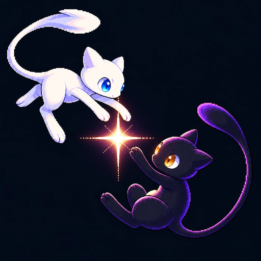

  

<h1 align="center">Eldoria</h1>

  Servidor de Minecraft com Cobblemon: um RPG de mundo aberto onde cada lugar tem uma história.

  <a href="https://github.com/eldoria-cobblemon/eldoria-launcher/releases/latest"><b>Baixar o launcher oficial</b></a>

---

### Como jogar

1. Baixe o **EldoriaLauncher-Setup** no link acima e instale.
2. Escolha seu nick e clique em **Jogar**. O launcher instala o Java, o Minecraft, os mods e o resourcepack sozinho.
3. No servidor, faça `/register <senha> <senha>` na primeira vez e `/login <senha>` nas próximas.

Na primeira instalação o Windows pode mostrar "O Windows protegeu o computador": clique em **Mais informações** e em **Executar assim mesmo**.

### O que tem em Eldoria

- Mundo aberto com vilas, ruínas e lugares abandonados cheios de memória
- Raids lendárias, bosses e a Temporada da Luz e das Trevas
- Torre Infinita, dungeons, pescaria e classes de RPG
- Skins exclusivas para Pokémon e para o seu personagem

### Segurança

O launcher só instala atualizações assinadas digitalmente pela equipe de Eldoria. Arquivo alterado ou de fora é recusado.
